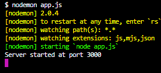
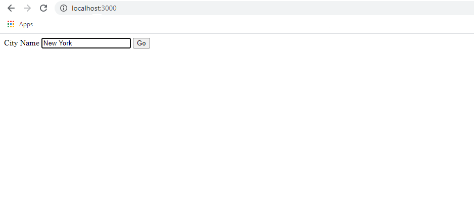
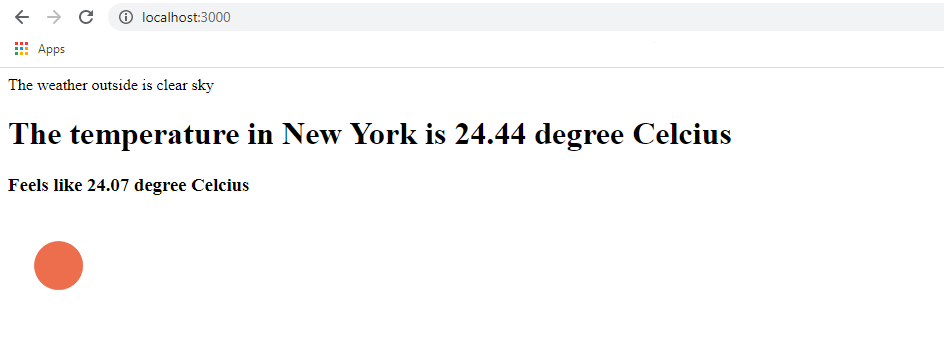

# Weather Project
-----------------------------------------------------------

* This project is the simplest implementation of the Express NodeJS server. It creates a server in your local machine and displays a web page at `localhost:3000`

* This server uses API defined in https://openweathermap.org/ to query the weather of a city entered by a user in the browser. The response obtained from OpenWeatherMap is displayed as a result in the browser.

* Node Modules used :
         > Express
         > HTTPS
         > body-parser

* This is a re-implementation of the same project that is given in the Udemy Course `The Complete 2020 Web Development Bootcamp` by `Angela Yu` on Udemy. I recommend this course to anyone interested in Web Development. She is my best teacher ever and the course is almost the perfect Full-Stack Development course out there.

------------------------------------------------------------

### Running the Server

* Create an account at https://openweathermap.org/ and go through the steps to generate an API key to authenticate your API calls to the OpenWeatherMap API server.

* Open the file `app.js` in a text editor of your choice. Paste the API key you generated within the single quotes next to the term `const apiKey =`. By doing this you are initializing the apiKey JS variable with your API key. Save the file and exit.

* Install the `Nodemon` Node module using NPM. Open Terminal / Command Prompt and navigate to this project directory. Type `nodemon app.js` and press `Enter` to start the server.

* Go to your browser and search `localhost:3000` to get the homepage. You can enter the city name here to get its weather.

* You get the weather data as a response.

* To stop the server -> Press `Ctrl + C` in the terminal/ Command prompt.
